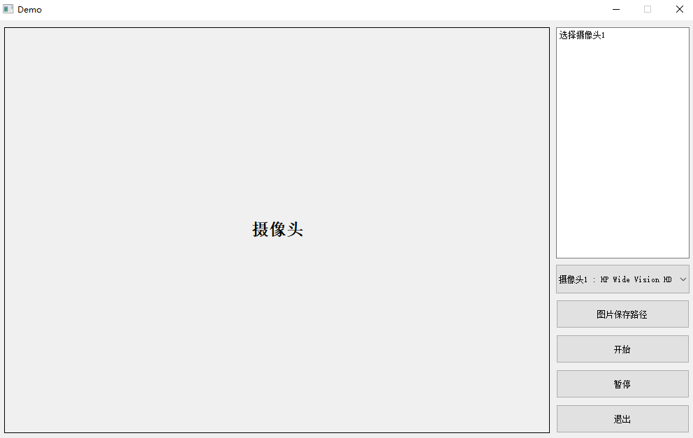

# Capture_Image

打开摄像头之后，定时采集图片

## 项目组成

- capture_image.py

  主程序

- collection_picture.py

  在Linux环境下使用视频流的形式采集图片

- mywiget.py

  ui文件

- ui2py.py

  .ui文件转.py文件

- video_capture.py

  打开摄像头并显示画面

